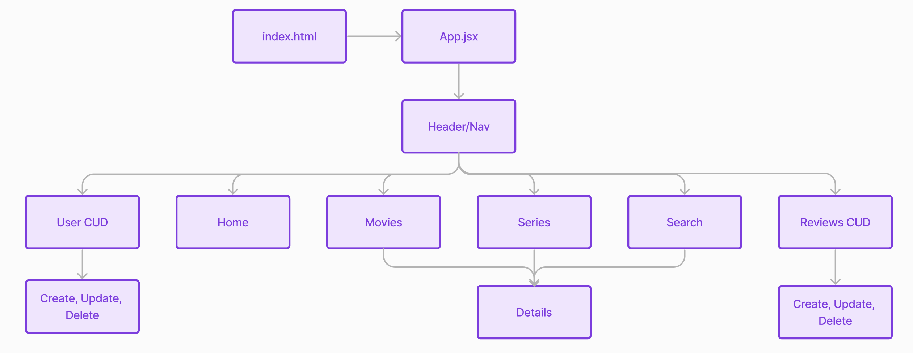

# UpNxt
With seemingly endless options for streaming, finding the next movie or show to watch can take almost as long as a feature film. UpNxt provides movies/shows availability across all your favorite streaming apps to save you time from swapping between each over and over. Users can provide their own scroes and reviews as well.

## Project Planning
[Working Trello Board](https://trello.com/invite/b/8c0CidtM/ATTI56b7880d05c4ce2ab846d0647d0c0a814860D981/upnxt)

### Entity Relationship Diagram (ERD)

### Home Page Wireframe

### Component Hierarchy Diagram

### Technologies Used
- MongoDB
- Express
- React
- NodeJS
- Bootstrap
- CSS
- HTML
- Axios

### Stretch Goals
- Movie/Series recommendation function
- Use third party API
- Implement Oauth with Auth0 for users
- Deploy with Railway, Heroku, or Netlify
- User Wishlist and Favorites
- Create animations, transitions, app logo

### Author
  

**Ryan Fitzgerald**  
Email: rfitzgerald806@gmail.com  
[LinkedIn](https://linkedin.com/in/ryan-fitzgerald-rf09) |
[GitHub](https://github.com/Ryan-Fitzgerald-9)